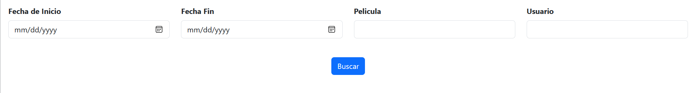
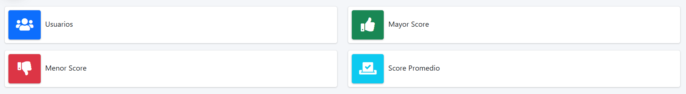

# Proyecto de Dashboard de Reseñas de Películas de Amazon
## Descripción
Este proyecto es una aplicación web que visualiza reseñas de películas de Amazon. Permite a los usuarios filtrar los datos por fecha, película y usuario, ofreciendo un análisis detallado de las reseñas a través de indicadores y visualizaciones.

## Características
#### Fuente de Datos: 
Datos del dataset de Amazon Movie Reviews almacenados en una base de datos PostgreSQL.

## Filtros Disponibles:
* Rango de fechas (obligatorio)
* Búsqueda de películas (autocompletado, opcional)
* Búsqueda de usuarios (autocompletado, opcional)


## Indicadores Disponibles:
* Cantidad de usuarios
* Máximo y mínimo score value
* Promedio del score value



## Tablas Generadas:
* Top 10 de mejores y peores scores
* Primeros 200 registros


## Visualizaciones:
* Línea de tiempo de doble eje (fechas vs promedio de score y fechas vs promedio de helpfulness)


### Restricciones de Visualización:
* No se genera gráfica si hay registros únicos sin reviews en el tiempo o si se filtra por un usuario que no hizo reviews en el período seleccionado.

## Tecnologías Utilizadas
* Backend: [Django](https://www.djangoproject.com/)
* Frontend: Responsive Design, junto con librerías JavaScript como [DataTables](https://datatables.net/) para la realizacion de las tablas y [Plotly](https://plotly.com/javascript/) para las graficas.
* Base de Datos: [PostgreSQL](https://www.postgresql.org/).
* Consulta de Datos: SQL puro, sin ORM de Django.

## Instalación y Configuración
* Crear un ambiente virtual utilizando venv.
```python
python -m venv venv
```
* Instalar las dependencias desde requirements.txt.
```python
pip install -r requirements.txt
```
* Configurar la base de datos y realizar las migraciones necesarias.
Iniciar el servidor Django.


## Uso
* Los filtros de fechas son obligatorios para todas las búsquedas.
* Los campos de usuario y película son autocompletados y opcionales.
* La aplicación genera tablas y visualizaciones basadas en los filtros aplicados.
* Las limitaciones de visualización deben ser consideradas al aplicar filtros específicos.